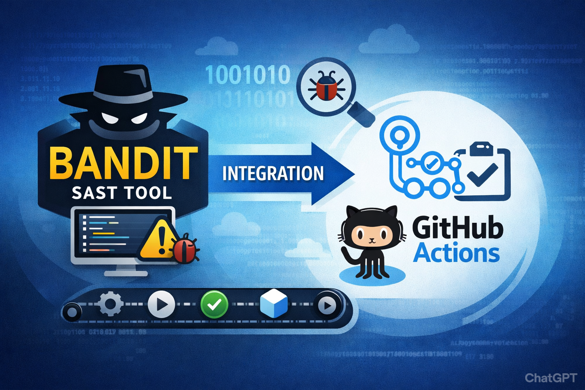
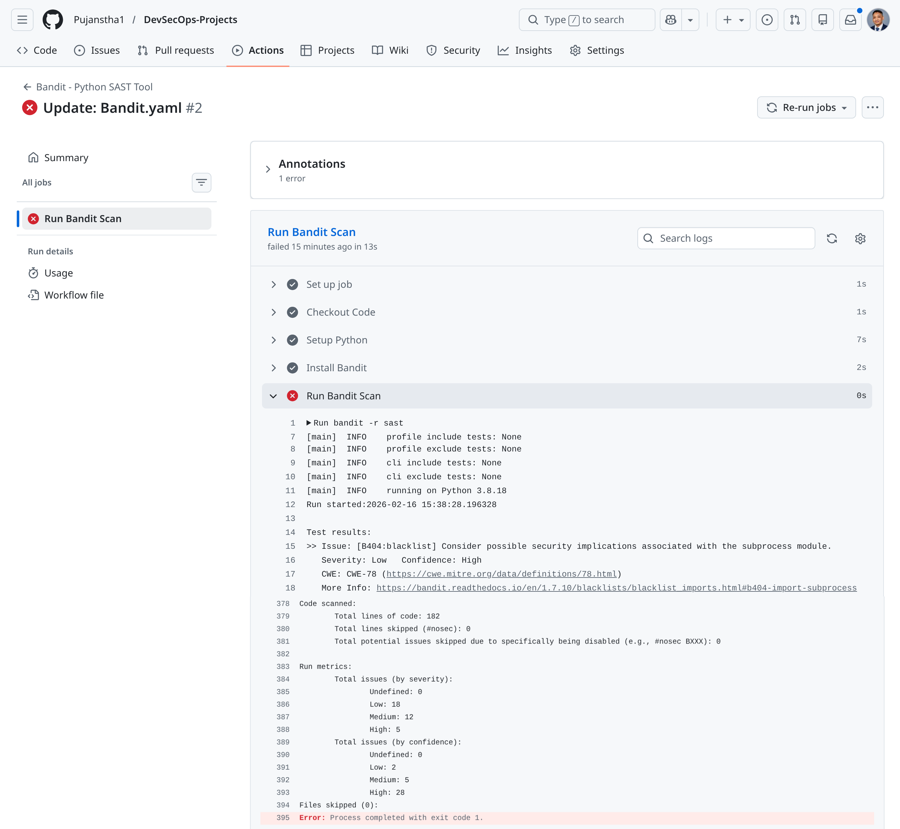

# Bandit Integration with GitHub Actions


## Introduction to Bandit

Bandit is a **Static Application Security Testing (SAST)** tool designed specifically for Python codebases. It helps developers identify common security issues in Python code by analyzing each file, building an Abstract Syntax Tree (AST), and running appropriate plugins against the AST nodes.

Bandit is developed by the Python Security community and is widely used in DevSecOps pipelines to catch security vulnerabilities early in the development lifecycle.

### How Bandit Works

Bandit operates in three main phases:

1. **Code Parsing**: Each Python file is parsed into an AST
2. **Plugin Execution**: Plugins are executed against the AST to detect specific security patterns
3. **Reporting**: Results are aggregated and reported with severity and confidence levels

### Severity Levels

Bandit categorizes issues by severity to help prioritize fixes:

- **High**: Critical security issues that could lead to immediate compromise
- **Medium**: Important security concerns that should be addressed
- **Low**: Best practice violations or potential security considerations

### Confidence Levels

Confidence indicates how certain Bandit is about the detection:

- **High**: Very likely to be a real security issue
- **Medium**: Potentially a security issue, may require manual verification
- **Low**: Could be a false positive, needs manual review

## GitHub Actions Integration

The workflow configuration below demonstrates how to integrate Bandit into a GitHub Actions CI/CD pipeline.

### Workflow Configuration

Create a file at `.github/workflows/sast-bandit.yaml`:

```yaml
name: Bandit - Python SAST Tool

on: [push]

jobs:
  sast_scan:
    name: Run Bandit Scan
    runs-on: ubuntu-latest

    steps:
      - name: Checkout Code
        uses: actions/checkout@v2

      - name: Setup Python
        uses: actions/setup-python@v2
        with:
          python-version: 3.8

      - name: Install Bandit
        run: pip install bandit

      - name: Run Bandit Scan
        run: bandit -r .
```
When a push event occurs in the repository, the **GitHub Actions** workflow is automatically triggered. As part of this CI pipeline, the **Bandit SAST** (Static Application Security Testing) tool executes and scans all Python files in the repository for potential security vulnerabilities. 

Bandit performs static code analysis to detect common security issues such as insecure function usage, hardcoded credentials, unsafe deserialization, and other Python-specific weaknesses. If vulnerabilities are identified that meet or exceed the defined severity threshold, the GitHub Actions workflow is marked as failed, indicating that the code does not meet the required security standards.

The scan results are published in the workflow run logs and include structured security findings with detailed metadata, typically covering:

- **Issue**– Description of the identified vulnerability
- **Severity** – Risk level (e.g., Low, Medium, High)
- **CWE** – Common Weakness Enumeration identifier
- **More Info** – Reference links or explanations about the vulnerability
- **Location** – Exact file path and line number where the issue was detected

This integration ensures that security checks are automatically enforced during development, preventing vulnerable Python code from being merged into the main branch.



# Bandit Scan Report

## Scan Results Summary

The Bandit scan was executed against the `sast` directory and identified **35 security issues** across various categories. Below is a detailed breakdown of the findings.

---

## Issue Summary by Severity
**Severity** indicates the **potential impact** of a security issue if it were exploited. Bandit classifies findings into **Low, Medium,** and **High** severity levels.

- **High Severity** – Critical vulnerabilities that could cause serious security problems. Example: disabling SSL verification (B501) or exposing sensitive data.

- **Medium Severity** – Issues that could weaken security but may not be immediately exploitable. Example: using MD5 hashing (B303).

- **Low Severity** – Minor issues, coding practices that are not recommended but pose less immediate risk. Example: importing subprocess without proper sanitization (B404).

The **Issue Summary by Severity table** shows how many findings fall into each category. This helps prioritize remediation: **High severity issues should be fixed first**, followed by Medium, then Low.

| Severity | Count |
|----------|-------|
| High     | 5     |
| Medium   | 12    |
| Low      | 18    |
| **Total** | 35   |

---

## Issue Summary by Confidence
**Confidence** indicates **how certain Bandit** is that a flagged issue is an actual security problem. Bandit labels each finding as **High, Medium, or Low confidence.**

- **High Confidence** – Very likely a real issue. You can almost always treat it as genuine.

- **Medium Confidence** – Likely an issue, but could be a false positive in some contexts.

- **Low Confidence** – Possibly an issue; may need manual verification to confirm if it is truly a vulnerability.

The **Issue Summary by Confidence** table helps you understand **how reliable the scan results are**. If most issues are high confidence, you can act on them quickly. Lower confidence issues may need review or testing before taking action.

| Confidence | Count |
|------------|-------|
| High       | 28    |
| Medium     | 5     |
| Low        | 2     |
| **Total**  | 35    |

---

## Detailed Findings

### 1. Insecure Module Imports (B404, B403, B405)
**Location:** `sast/app.py` (lines 6, 10, 20)  
**Issue:** Import of potentially dangerous modules  
**Severity:** Low | **Confidence:** High  

**Details:**
- `subprocess` module (B404): Can lead to command injection  
- `pickle` module (B403): Unsafe for untrusted data deserialization  
- `xml.etree.ElementTree` (B405): Vulnerable to XML attacks (Billion Laughs, XXE)

---

### 2. Hardcoded Credentials (B105)
**Location:** `sast/app.py` (lines 31, 33)  
**Issue:** Hardcoded passwords and secrets  
**Severity:** Low | **Confidence:** Medium  

**Findings:**
- AWS Secret Key: `verysecretkey1234567890`  
- Database Password: `P@ssw0rd1234`

---

### 3. Weak Cryptographic Practices (B303)
**Location:** `sast/app.py` (line 40)  
**Issue:** Use of insecure MD5 hash function  
**Severity:** Medium | **Confidence:** High  

**Impact:** MD5 is cryptographically broken and vulnerable to collision attacks

---

### 4. Insecure Random Number Generation (B311)
**Location:** `sast/app.py` (line 51)  
**Issue:** Use of `random` module for security purposes  
**Severity:** Low | **Confidence:** High  

**Impact:** The `random` module is not cryptographically secure

---

### 5. SSL Certificate Validation Disabled (B501)
**Location:** `sast/app.py` (line 63)  
**Issue:** `requests.get()` called with `verify=False`  
**Severity:** High | **Confidence:** High  

**Impact:** Disables SSL certificate verification, enabling Man-in-the-Middle (MITM) attacks

---

### 6. Missing Request Timeout (B113)
**Location:** `sast/app.py` (line 63)  
**Issue:** HTTP request without timeout  
**Severity:** Medium | **Confidence:** Low  

**Impact:** Application may hang indefinitely if the server doesn't respond

---

### 7. Silent Exception Handling (B110)
**Location:** `sast/app.py` (lines 283, 289)  
**Issue:** Bare `except` block with `pass`  
**Severity:** Low | **Confidence:** High  

**Impact:** Swallows exceptions, making debugging difficult and potentially hiding security-relevant errors

---

## Remediation Recommendations

| Issue ID | Finding | Recommended Fix |
|----------|---------|----------------|
| B404 | Subprocess import | Validate and sanitize all inputs to subprocess; consider using `shlex.quote()` |
| B403 | Pickle import | Use safer serialization formats like JSON; if pickle is necessary, never unpickle untrusted data |
| B405 | XML parsing | Replace with `defusedxml.ElementTree` or call `defusedxml.defuse_stdlib()` |
| B105 | Hardcoded credentials | Use environment variables or secrets management (e.g., AWS Secrets Manager, HashiCorp Vault) |
| B303 | MD5 usage | Replace with SHA-256 or SHA-3 family hash functions |
| B311 | Insecure random | Use `secrets` module for cryptographic purposes |
| B501 | SSL verification disabled | Remove `verify=False` or set to `verify='/path/to/cert.pem'` |
| B113 | Missing timeout | Add timeout parameter: `requests.get(url, timeout=10)` |
| B110 | Silent exception handling | Log exceptions appropriately or handle specific exception types |

---


The Bandit scan successfully identified **35 security issues** in the Python codebase, including **5 high-severity vulnerabilities** related to SSL verification and insecure configurations. All findings should be addressed based on their severity, with high and medium issues prioritized for immediate remediation.

Integration of Bandit into the GitHub Actions pipeline provides **automated security feedback on every push**, enabling the development team to catch and fix security issues early in the development lifecycle.

---


