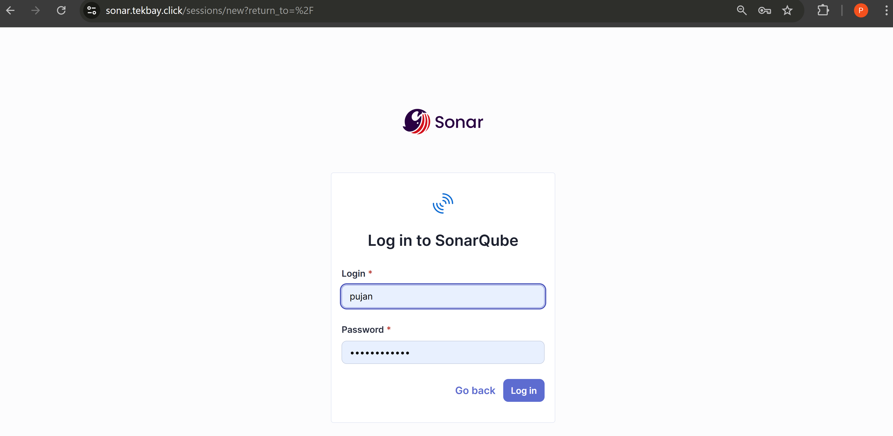
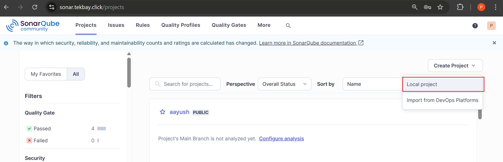
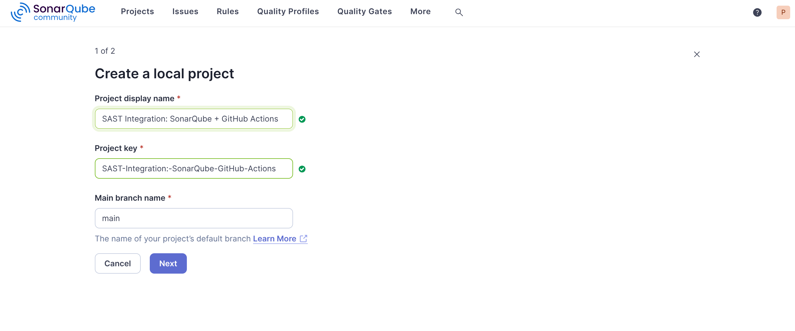
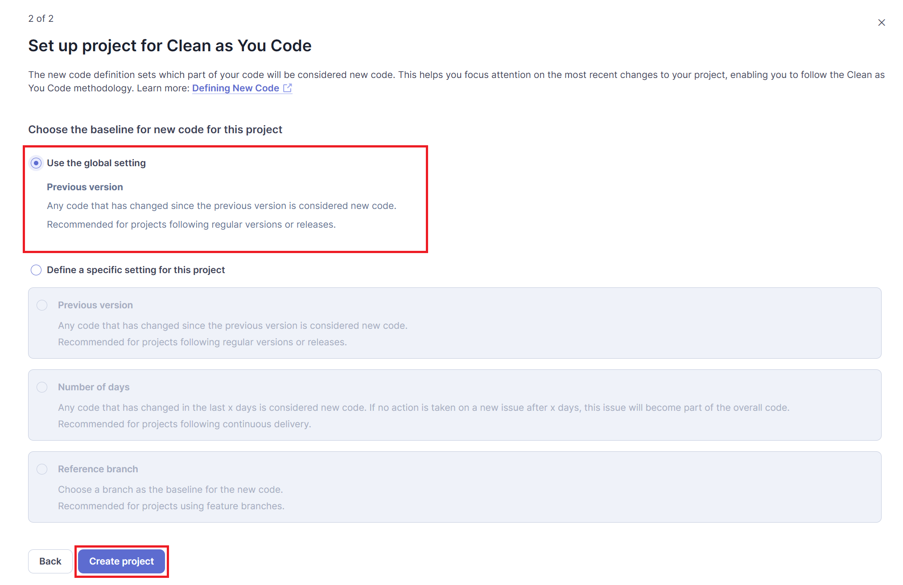
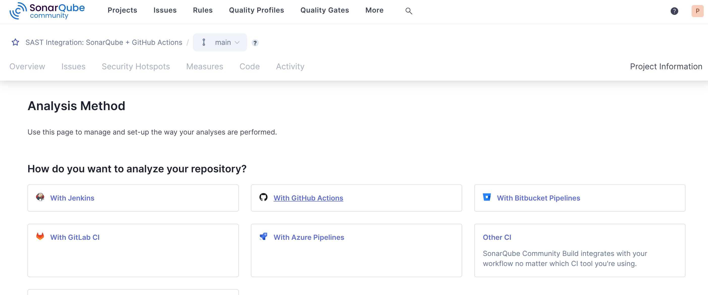
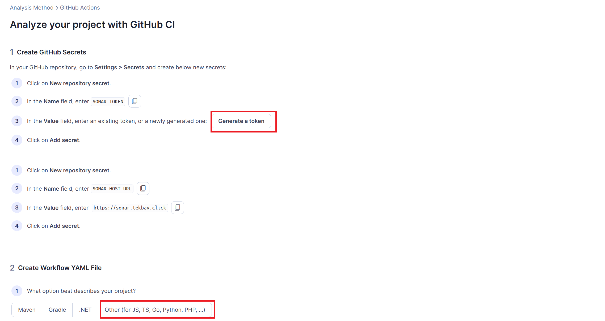
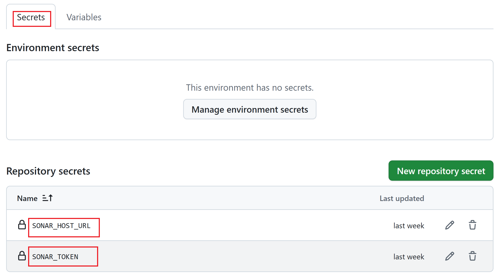
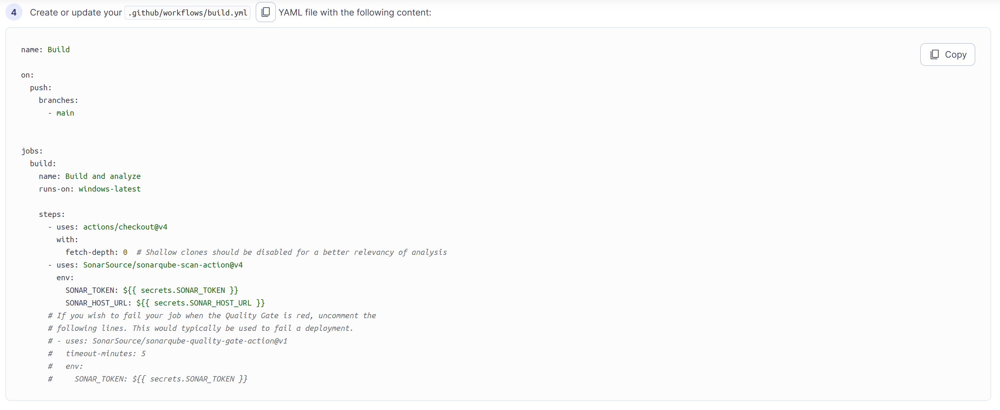

# SonarQube Integration with GitHub Actions

This guide walks you through the complete process of setting up SonarQube code analysis for your GitHub repository using GitHub Actions.

## Prerequisites

- Access to a SonarQube instance
- A GitHub repository
- Repository admin access to configure secrets and workflows

---

## Part 1: SonarQube Project Configuration

### Step 1: Login to SonarQube

1. Open your web browser and navigate to your SonarQube instance
2. Enter your credentials to log in



### Step 2: Create a New Local Project

1. After successful login, locate and click on the option to create a new project
2. Select **"Create a local project"** option



### Step 3: Enter Project Details

Fill in the required project information:

- **Project display name**: Enter a descriptive name for your project
- **Project key**: Provide a unique identifier for the project
- **Main branch name**: Specify your main branch (typically `main` or `master`)



### Step 4: Configure Analysis Settings

When prompted for project settings:

1. Select **"Use the Global Setting"** option
2. This will apply the default SonarQube configuration to your project



### Step 5: Select Analysis Method

Choose how SonarQube will analyze your code:

1. From the available options, select **"GitHub Actions"**
2. This will enable automated code analysis through your CI/CD pipeline



---

## Part 2: GitHub Repository Configuration

### Step 6: Navigate to Repository Secrets

To establish secure communication between GitHub and SonarQube, you need to configure repository secrets:

1. Go to your GitHub repository
2. Click on **Settings** (top menu bar)
3. In the left sidebar, navigate to **Secrets and variables** → **Actions**
4. Click the **"New repository secret"** button



### Step 7: Add SONAR_TOKEN Secret

1. Click **"New repository secret"**
2. In the **Name** field, enter: `SONAR_TOKEN`
3. In the **Value** field, paste your SonarQube authentication token
   - If you don't have a token, generate one from SonarQube: User Menu → My Account → Security → Generate Token
4. Click **"Add secret"** to save

### Step 8: Add SONAR_HOST_URL Secret

1. Click **"New repository secret"** again
2. In the **Name** field, enter: `SONAR_HOST_URL`
3. In the **Value** field, enter: `https://sonar.tekbay.click`
4. Click **"Add secret"** to save



> **Note**: Both secrets are now securely stored and will be accessible to your GitHub Actions workflows.

---

## Part 3: GitHub Actions Workflow Setup

### Step 9: Select Your Project Type

SonarQube provides different configurations based on project type. Choose the one that matches your project:

- **Maven** - For Java projects using Maven
- **Gradle** - For Java projects using Gradle
- **.NET** - For C# and .NET applications
- **Other** - For JavaScript, TypeScript, Go, Python, PHP, and other languages

For most non-Java projects, select **"Other"**.



### Step 10: Create the Workflow File

1. In your repository, create the following directory structure if it doesn't exist:
   ```
   .github/workflows/
   ```

2. Create a new file named `build.yaml` in this directory:
   ```
   .github/workflows/build.yaml
   ```

3. Paste the following workflow configuration:

```yaml
name: Build
on:
  push:
    branches:
      - main
jobs:
  build:
    name: Build and analyze
    runs-on: ubuntu-latest
    
    steps:
      - uses: actions/checkout@v4
        with:
          fetch-depth: 0  # Shallow clones should be disabled for a better relevancy of analysis
      - uses: SonarSource/sonarqube-scan-action@v4
        env:
          SONAR_TOKEN: ${{ secrets.SONAR_TOKEN }}
          SONAR_HOST_URL: ${{ secrets.SONAR_HOST_URL }}
      # If you wish to fail your job when the Quality Gate is red, uncomment the
      # following lines. This would typically be used to fail a deployment.
      # - uses: SonarSource/sonarqube-quality-gate-action@v1
      #   timeout-minutes: 5
      #   env:
      #     SONAR_TOKEN: ${{ secrets.SONAR_TOKEN }}
```

### Step 11: Commit and Push Changes

1. Save the `build.yaml` file
2. Commit the changes to your repository:
   ```bash
   git add .github/workflows/build.yaml
   git commit -m "Add SonarQube analysis workflow"
   git push origin main
   ```

3. The workflow will automatically trigger on push to the `main` branch
4. Navigate to the **Actions** tab in your GitHub repository to monitor the workflow execution

---

## Workflow Explanation

The workflow performs the following actions:

- **Triggers**: Runs automatically when code is pushed to the `main` branch
- **Checkout**: Retrieves the full repository history for accurate analysis
- **SonarQube Scan**: Analyzes code quality and security using your SonarQube instance
- **Quality Gate** (optional): Can be configured to fail the build if code quality standards aren't met

---

## Verification

After pushing your workflow file:

1. Go to your GitHub repository's **Actions** tab
2. You should see the "Build" workflow running
3. Once complete, check your SonarQube dashboard to view the analysis results
4. Review code quality metrics, bugs, vulnerabilities, and code smells

---

## Troubleshooting

**Workflow fails to run:**
- Verify that both secrets (`SONAR_TOKEN` and `SONAR_HOST_URL`) are correctly configured
- Ensure the secret names match exactly (case-sensitive)

**SonarQube connection issues:**
- Confirm the `SONAR_HOST_URL` is accessible from GitHub Actions runners
- Verify your SonarQube token hasn't expired

**Analysis not appearing in SonarQube:**
- Check that the project key in SonarQube matches your configuration
- Review the workflow logs for any error messages

---